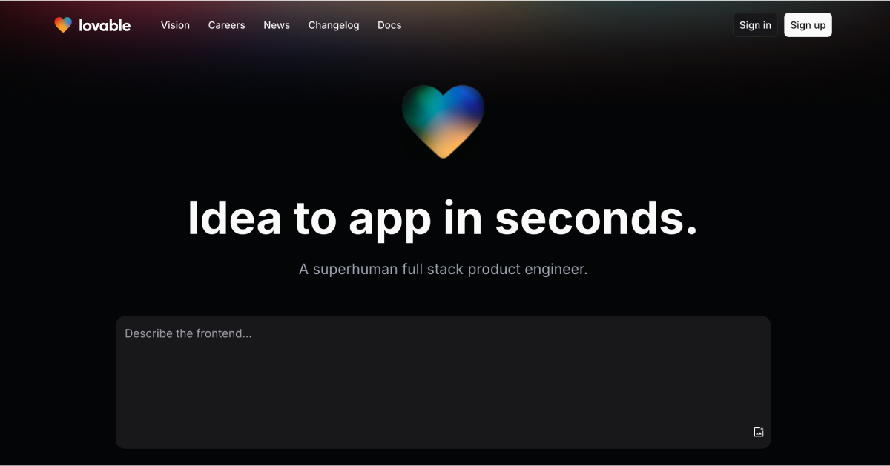

# Harmony App - Ứng dụng Nghe Nhạc



## Giới Thiệu

Harmony App là một ứng dụng nghe nhạc hiện đại được phát triển bằng công nghệ React, TypeScript và Vite. Ứng dụng cung cấp giao diện người dùng đẹp mắt và trải nghiệm nghe nhạc mượt mà.

## Tính Năng

- 🎵 Phát nhạc từ thư viện cá nhân
- 🔄 Trình phát với các chức năng: phát, tạm dừng, chuyển bài
- 📱 Giao diện người dùng tương thích với nhiều thiết bị (responsive)
- 🌓 Hỗ trợ chế độ sáng/tối
- 📋 Quản lý danh sách phát
- 🎨 Giao diện được thiết kế với Tailwind CSS và shadcn/ui

## Cài Đặt

### Yêu Cầu

- Node.js (phiên bản 18.0.0 trở lên)
- npm hoặc bun

### Các Bước Cài Đặt

1. Clone repository:
   ```bash
   git clone <repository-url>
   cd harmony-app
   ```

2. Cài đặt các dependencies:
   ```bash
   npm install
   # hoặc
   bun install
   ```

3. Khởi chạy ứng dụng ở môi trường phát triển:
   ```bash
   npm run dev
   # hoặc
   bun run dev
   ```

4. Mở trình duyệt và truy cập: `http://localhost:5173`

## Xây Dựng (Build)

Để xây dựng ứng dụng cho môi trường production:

```bash
npm run build
# hoặc
bun run build
```

Để xem trước phiên bản build:

```bash
npm run preview
# hoặc
bun run preview
```

## Công Nghệ Sử Dụng

- **Framework**: React 18
- **Ngôn ngữ**: TypeScript
- **Build Tool**: Vite
- **CSS**: Tailwind CSS
- **UI Components**: shadcn/ui (dựa trên Radix UI)
- **Quản lý Form**: React Hook Form + zod
- **Routing**: React Router
- **State Management**: React Context API
- **UI/UX**: Lucide React (icons)

## Cấu Trúc Dự Án

```
harmony-app/
├── src/
│   ├── components/    # Các component UI
│   ├── context/       # React Context
│   ├── hooks/         # Custom React hooks
│   ├── lib/           # Utility libraries
│   ├── pages/         # Các trang của ứng dụng
│   ├── styles/        # Global styles
│   ├── types/         # TypeScript type definitions
│   ├── utils/         # Helper functions
│   ├── App.tsx        # Component chính
│   └── main.tsx       # Entry point
├── music/             # Thư mục chứa các file nhạc
├── public/            # Static assets
├── index.html         # HTML entry point
├── vite.config.ts     # Cấu hình Vite
└── package.json       # Dependencies và scripts
```

## Đóng Góp

Nếu bạn muốn đóng góp cho dự án, hãy tạo pull request. Chúng tôi rất hoan nghênh sự đóng góp của cộng đồng!

## Giấy Phép

Dự án này được phân phối theo giấy phép MIT. Xem file `LICENSE` để biết thêm chi tiết.

## Tác Giả

- **@deanqkhanhcoder**

---

Được xây dựng với ❤️ bằng React, TypeScript và Vite.
